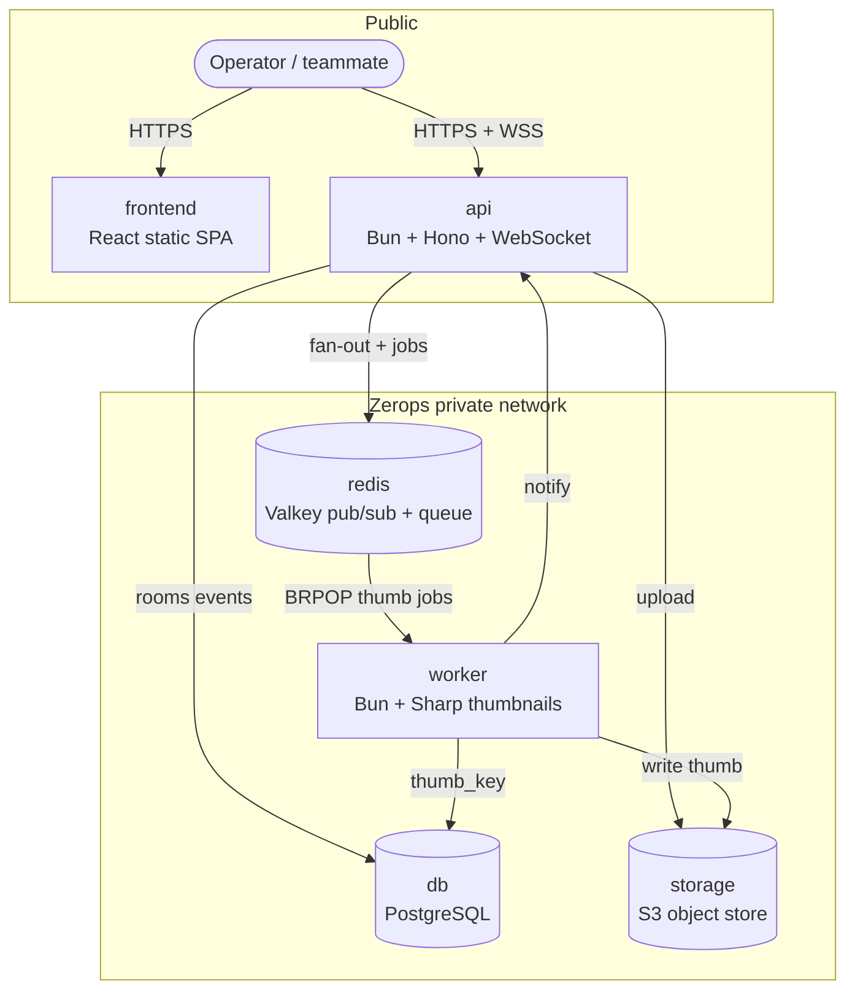

# Flare

Live multiplayer incident war-room. Share a room link — severity, blast radius, timeline, and presence sync across tabs. Screenshots upload to object storage; a worker builds thumbnails. Probe external URLs for health checks.

**Live:** https://frontend-2b1c.prg1.zerops.app  
**API:** https://api-2b1c-3000.prg1.zerops.app  
**Repo:** https://github.com/mdshzb04/flare

**Zerops Challenge entry.** Six services. Not a Hello World.

## Live demo story (60s)

1. Open Flare → create war-room  
2. Copy link → second browser tab  
3. Type update in tab A → appears in tab B  
4. Mark **api** on the blast map → cascade hops + live metrics tick  
5. Upload screenshot → thumbnail lands via worker  
6. Resolve → Discord all-clear (when webhook configured)

## Architecture (Zerops)

Six services. Public edge = `frontend` + `api`. Everything else stays on the Zerops private network.



**Data paths:**
- **War room sync:** browser → `api` WS → Valkey publish → other tabs  
- **Screenshot:** upload → `storage` → Valkey queue → `worker` thumbnail → WS `event:thumb`  
- **URL check:** landing probe → `api` HTTP fetch → indexed check room on dashboard  
- **Live metrics:** `worker` ticks per-room load sim → Valkey → open war rooms  

| Service | Role | Exposure |
|---------|------|----------|
| `frontend` | React SPA | public |
| `api` | HTTP + WebSocket | public |
| `worker` | Thumbnails + room metrics | private |
| `db` | Postgres persistence | private |
| `redis` | Pub/sub + queue | private |
| `storage` | Screenshots / thumbs | private API, public object URLs |

## Stack

- Frontend: React + Vite + TypeScript  
- API: Bun + Hono + WebSocket  
- Worker: Bun + Sharp  
- Postgres, Valkey, S3 (MinIO locally / Zerops object storage in prod)

## Local run (~5 min)

```bash
cp .env.example .env
docker compose up -d
# create bucket once MinIO is up (or API creates it):
docker run --rm --network host minio/mc alias set local http://127.0.0.1:9000 flareflare flareflare && docker run --rm --network host minio/mc mb -p local/flare || true
bun install
bun run dev:api      # :3000
bun run dev:worker
bun run dev:web      # :5173
```

Open http://localhost:5173

Self-check (no DB): `bun run check`

Optional: purge seeded test incident rooms from local Postgres:

```bash
bun run scripts/cleanup-test-rooms.ts
```

## Deploy on Zerops

1. Create account → new project  
2. **Import** [`import-services.yml`](./import-services.yml)  
3. Connect this GitHub repo to `api`, `worker`, `frontend` (or `zcli push`)  
4. Enable **public HTTP** on `api` and `frontend`  
5. On `frontend` service env, set:
   - `API_PUBLIC_URL` = public HTTPS URL of api (no trailing slash)
   - `WS_PUBLIC_URL` = same host with `wss://…/ws`  
6. Redeploy frontend so Vite bakes those URLs  
7. Open frontend URL  

`zerops.yaml` setups: `api`, `worker`, `frontend`.

## AI disclosure

Built with **Cursor** (Composer) assistance. Architecture, product decisions, and review by the participant.

## License

MIT — yours for the challenge.
